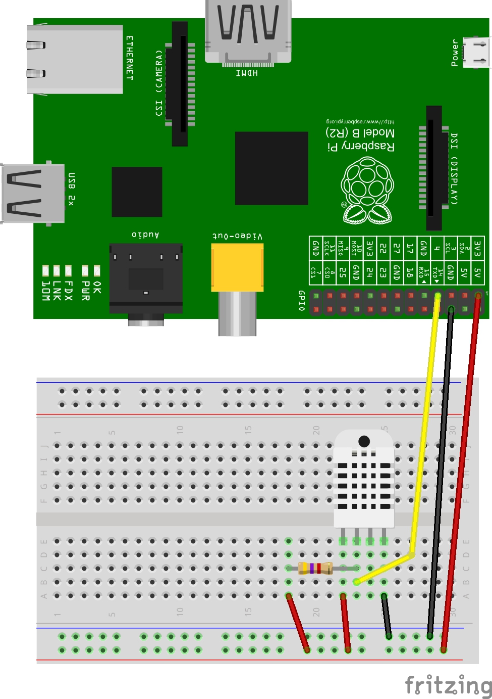
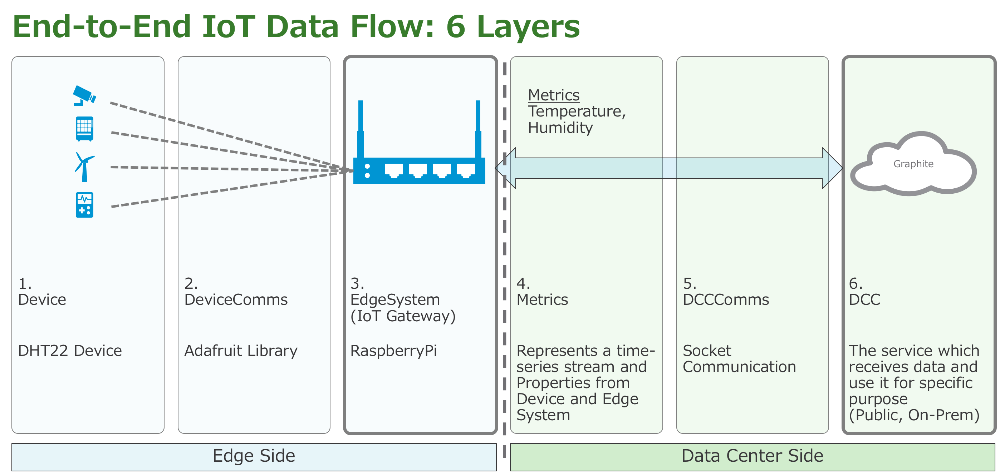
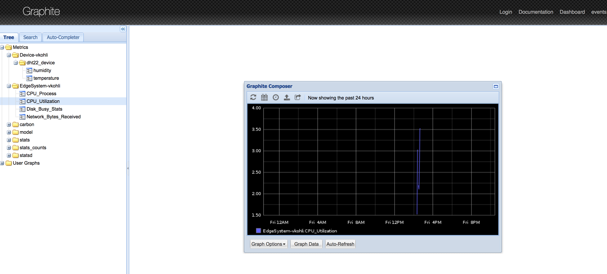

In this tutorial, we'll cover the basic flow of running Liota on Raspberry Pi. Liota follows the IoT three-tier model, it resides on the IoT gateway and allows you to collect & publish metrics from devices and gateway to the DCC (Data Center Component) of your choice. We'll be collecting edge system (RPi) stats, temperature & humidity metrics from the DHT22 sensor and will publish the values to Graphite DCC.

Hardware Required:

1. Breadboard
2. Jumper cables
3. 4.7k Ohm resistor
4. RaspberryPi
5. AM2302/DHT22/DHT11 sensor

Wire the RaspberryPi and sensor as shown in the picture below, if the external devices are disconnected, or high-impedance gets introduced the pull-up resistor attached will ensure that the signal will be a valid logic level.



In the RaspberryPi shell you can switch to root user or use "sudo" command as required, update the Raspbian OS:
```sh
$ su 
Password:
$ sudo apt-get update
```

Set the time zone correctly:
```sh
$ sudo date -s "18 Jun 2017 09:14:00 UTC"
```

To communicate with the sensor and collect temperature & humidity metric we'll be using Adafruit_Python_DHT library.

Install the required dependencies:
```sh
$ sudo apt-get install -y build-essential python-dev git
```
Install the Adafruit Library:
```sh
$ sudo mkdir -p /home/pi/sources
$ cd /home/pi/sources
$ sudo git clone https://github.com/adafruit/Adafruit_Python_DHT.git
$ cd Adafruit_Python_DHT
$ sudo python setup.py install
```

You can test if the library is properly installed by running the below command, you'll be getting the temperature and the humidity as the output at the current point of time:
```sh
$ sudo /home/pi/sources/Adafruit_Python_DHT/examples/AdafruitDHT.py 2302 4
```

Post this step let's install liota
```sh
$ sudo pip install liota
```

Some tasks to understand the liota directory structure
```sh
$ cd /etc/liota/conf
```

Look into liota.conf, logging.json

```sh
$ cd /var/log/liota
(this is where the log files go)

$ cd /etc/liota/examples
(look around for Liota examples)

$ cd /etc/liota/packages
(we`ll use this package examples)

$ cd /etc/liota/packages/examples
(pkg Mgr examples)

$ cd /etc/liota/packages/edge_systems
(system packages)
```

Liota has the package manager feature which allows to dynamically load/unload the packages representing the fundamental building blocks of Liota as shown in the figure below.


For this tutorial we have pre-created the packages required, users of Liota can reference them in future to create their own packages as per the IoT use case. Post-Liota installation the packages can be found in the following directory “/etc/liota/packages”.



1. **dh22_device:** Device Package

2. **Adafruit:** It is the library used to collect the values from the DHT22 sensor, over here it acts as the device communication protocol.

3. **edge_systems/rpi/edge_system:** Raspberry Pi Edge System Package

4. **graphite_rpi_stats:** This package collects the CPU utilisation, networking and disk usage stats from RPi.
   
   **graphite_dht22_metrics:** It is the package which defines the metrics temperature and humidity to be collected. 

5. **Socket:** Package uses Socket as the DCC_Comms to publish data to DCC

6. **graphite_rpi:** This package defines Graphite DCC and registers RPi Edge System.
                 (https://graphite.readthedocs.io/en/latest/)

# LIOTA Abstractions
The basic abstraction classes provided by Liota which can help developers to develop their own Liota components:

```sh
dcc_comms:  Abstract class for all the DCC communications.

   _connect(): Establish connection to DCC
   
   _disconnect(): Disconnecting the connection to DCC
   
   send(message,msg_attr): Publish sensor values to DCC, msg_attr is used 
   to hold the specific parameters required to publish the data
   
   receive(msg_attr): Receive messages from the DCC, msg_attr is used to 
   specify the required parameters
```

```sh
device_comms: Abstract class for all device communications

   _connect(): Establish connection to device
   
   _disconnect(): Disconnect the connection to device
   
   send(message): Publish message to device if it receives messages or acts as an actuator
   
   receive(): Receive the data from the device
```  

```sh
DCC: Abstract class for all DCC's

   register(entity_obj): Register entity object with DCC
   
   create_relationship(reg_entity_parent, reg_entity_child): Create child-parent relationship 
   between two entity objects
   
   _format_data(reg_metric): Formats the collected reg_metric(Registered Metric) data, sensor 
   values as per the DCC format before publishing
   
   publish(reg_metric):  An instance method used to publish the data to DCC, it also uses 
   reg_metric.msg_attr for holding the various parameters which might be required to publish 
   the message.
   
   set_properties(reg_entity, properties): Used to set properties for the required reg_entity.
   
   unregister(entity_obj): Unregister the entity object from DCC
```

```sh
Entity: Abstract base class for all the entities(Device, Edge System and Metric are 
considered as entities in Liota terminology), it require following arguments for initializing:
   name, 
   entity_id,
   entity_type
```

```sh
RegisteredEntity: Represents the registered (Device, Edge System & Metric) entity object. Requires
following argument for initializing: 
   entity, 
   dcc,
   reg_entity_id: unique identifier received from the DCC post registration
 
   set_properties(properties): instance method to set properties for the registered entity object
```

```sh
Device: Abstract base class for the all the edge systems (Gateways), requires following argument 
for initializing:
   entity_id: locally generated id using Liota,
   entity_type: hard coded value to “EdgeSystem”
```

```sh
Metric: Defines the metric object which requires following argument for initializing:
   name: metric name,
   unit: unit defined for metric, liota uses by default Pint library to set SI units,
   interval: time interval required to collect the metric value,
   aggregation_Size: the number of values to be aggregated before publishing to DCC,
   sampling_function: Method responsible for collecting the sensor values
   
   register (dcc_obj, reg_entity_id): this method is used to return the registered metric object 
   requires parameters dcc_obj(DCC Object) & reg_entity_id (Registered entity unique identifier)
```

For this tutorial, we'll require installing the Graphite DCC in a docker container. It can be installed on a separate machine/VM to which RPi has networking access.

You need to install the Docker engine in the machine/VM preferably Ubuntu 16.04 OS. Follow the instructions in the below link to install Docker CE:

https://docs.docker.com/engine/installation/

Post installation Graphite container can be deployed with help of this command:

```sh
$ docker run -d\
 --name graphite\
 --restart=always\
 -p 80:80\
 -p 2003-2004:2003-2004\
 -p 2023-2024:2023-2024\
 -p 8125:8125/udp\
 -p 8126:8126\
 hopsoft/graphite-statsd
```

Now, let's start the Liota package manager and load the packages required to publish data from the devices to Gateway and then to DCC.

```sh
$ cd /etc/liota/packages
```
Start Liota Package Manager:

```sh
$ sudo python liotad.py &
```
Open a new ssh session to the RPi and list the loaded package:
```sh
$ tail -f /var/log/liota/liota.log

(In the first shell)
$ sudo ./liotapkg.sh list pkg
```

Modify sampleProp.conf:
```sh
$ cd /etc/liota/packages/
$ sudo pico sampleProp.conf
(use editor of your choice)

Replace “EdgeSystem-Name” & “Device-Name” with some unique name (maybe your first-last-name)

GraphiteIP is “127.0.0.1” or the machine IP address (in quotes)

GraphitePort is 2003 (without quotes)
```

Before loading the packages, we'll generate their SHA-1 hash and then load them with message digest so that they can be verified and then loaded securely.
Let's start with loading the RPi Edge_system package:
```sh
$ sha1sum edge_systems/rpi/edge_system.py
bc2bebc5fec770b9df4a67bc6c410c33ecf2513b  edge_systems/rpi/edge_system.py

$ sudo ./liotapkg.sh load edge_systems/rpi/edge_system bc2bebc5fec770b9df4a67bc6c410c33ecf2513b
```

Load the Graphite package:
```sh
$ sha1sum graphite_rpi.py
7df53502405f5adcc3f4353167b9ce3f70e5e810  graphite_rpi.py

$ sudo ./liotapkg.sh load graphite_rpi 7df53502405f5adcc3f4353167b9ce3f70e5e810
```

After we have loaded the DCC package we'll load the edge_system stats package:
```sh
$ sha1sum examples/graphite_rpi_stats.py
bb8cc01a251bf445c16c1d633a7fcb36f2d04a52  examples/graphite_rpi_stats.py

$ sudo ./liotapkg.sh load examples/graphite_rpi_stats bb8cc01a251bf445c16c1d633a7fcb36f2d04a52
```

Load the DHT22 Device package and the stats to be published to Graphite DCC:
```sh
$ sha1sum examples/dht22_device.py
734345f7d2d420c28ff0aad745b31ea84dad1921  examples/dht22_device.py

$ sudo ./liotapkg.sh load examples/dht22_device 734345f7d2d420c28ff0aad745b31ea84dad1921

$ sha1sum examples/graphite_dht22_metrics.py
8a25c7f37eacd72ef478c50389e3114bfabaacc4  examples/graphite_dht22_metrics.py

$ sudo ./liotapkg.sh load examples/graphite_dht22_metrics 8a25c7f37eacd72ef478c50389e3114bfabaacc4
```

List all the loaded Liota packages:
```sh
$ sudo ./liotapkg.sh list pkg
```

After loading all the packages look at Graphite and find your metric, refresh the browser the stats might appear after a minute:

http://graphite-ip-address:8080

http://graphite-ip-address:8080/dashboard




Package_Dependencies are defined at the top of the package.Finally, we can unload all the packages from Liota daemon by unloading the base package edge_systems/rpi/edge_system, all the other packages are directly or indirectly dependent on it.

```sh
$ sudo ./liotapkg.sh unload edge_systems/rpi/edge_system
```

Happy Hacking!!!
