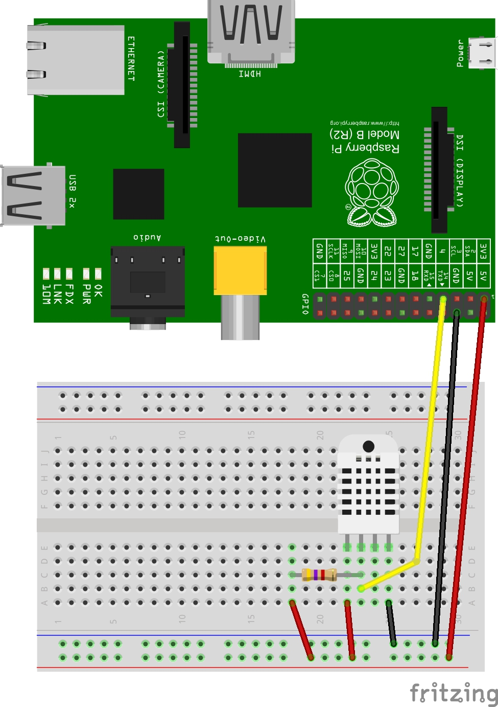
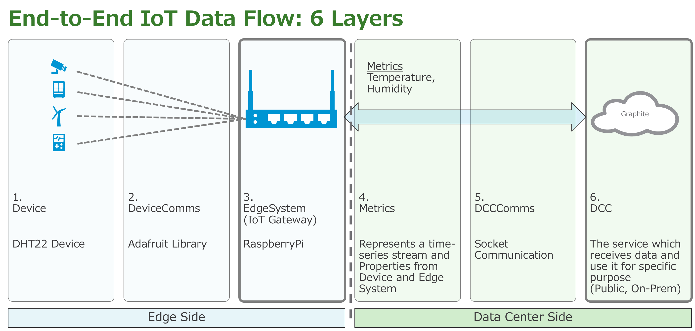

In this tutorial, we'll cover the basic flow of running Liota on Raspberry Pi. Liota follows the IoT three-tier model, it resides on the IoT gateway and allows you to collect & publish metrics from devices and gateway to the DCC (Data Center Component) of your choice. We'll be collecting edge system (RPi) stats, temperature & humidity from the DHT22 sensor and will publish them to Graphite DCC.

Hardware Required:

1. Breadboard
2. Jumper cables
3. 4.7k Ohm resistor
4. RaspberryPi
5. AM2302/DHT22/DHT11 sensor

Wire the RaspberryPi and sensor as shown in the picture below, if the external devices are disconnected, or high-impedance gets introduced the pull-up resistor attached will ensure that the signal will be a valid logic level.



Update the Raspbian OS:
```bash
$ sudo apt-get update
```

Set the time zone correctly:
```bash
$ date -s "18 Jun 2017 09:14:00"
```

To communicate with the sensor and collect temperature & humidity metric we'll be using Adafruit_Python_DHT library.

Install the required dependencies:
```bash
$ sudo apt-get install -y build-essential python-dev git
```
Install the Adafruit Library:
```bash
$ mkdir -p /home/pi/sources
$ cd /home/pi/sources
$ git clone https://github.com/adafruit/Adafruit_Python_DHT.git
$ cd Adafruit_Python_DHT
$ sudo python setup.py install
```

You can test if the library  properly installed by running the below command, you'll get the temperature and humidity as the output at the current point of time:
```bash
$ sudo /home/pi/sources/Adafruit_Python_DHT/examples/AdafruitDHT.py 2302 4
```

Post this step we'll install liota
```bash
$ pip install liota
```

Some tasks to understand the liota directory structure
```bash
$ cd /etc/liota/conf
```

Look into liota.conf, logging.json

```bash
$ cd /var/log/liota
(this is where the log files go)

$ cd /etc/liota/examples
(look around for Liota examples)

$ cd /etc/liota/packages
(we`ll use this examples)

$ cd /etc/liota/packages/examples
(pkg Mgr examples)

$ cd /etc/liota/packages/edge_systems
(system packages)
```

Liota has the package manager feature which allows to dynamically load/unload the packages representing the fundamental building blocks of Liota as shown in the figure below.


For this tutorial we have pre-created the packages required, users of Liota can reference them in future to create their packages as per the IoT use case. Post-Liota installation the packages can be found in the following directory “/etc/liota/packages”.



1. dh22_device: Device Package

2. Adafruit: It is the library used to collect the value from the DHT22 sensor over here it acts as the device communication protocol.

3. edge_system/rpi/edge_systems: Raspberry Pi Edge System Package

4. graphite_rpi_stats: Package collect the CPU utilization, networking and disk usage stats from RPi.
   graphite_dht22_metrics: It is the package which defines the metrics Temperature and Humidity to be collected. 

5. Socket: Package which uses Socket as the DCC_Comms to publish data to DCC

6. graphite_rpi: It is the Liota package which defines Graphite DCC and registers RPi Edge System.
                 (https://graphite.readthedocs.io/en/latest/)

For this tutorial, we'll require installing the Graphite DCC in a docker container. It can be installed on a separate machine/VM to which RPi has the networking access.

You need to install the Docker engine in the machine/VM preferably Ubuntu 16.04 OS. The instruction in the below link can be followed to install Docker CE:

https://docs.docker.com/engine/installation/

If in case, you don't have a separate VM or a machine for the Graphite Docker container then it can be deployed locally on the RPi.

Docker Engine can be installed on RPi as per the instructions in below link:

https://www.raspberrypi.org/blog/docker-comes-to-raspberry-pi/


Post installation Graphite container can be deployed with help of this command:

```bash
$ docker run -d
 --name graphite
 --restart=always
 -p 80:80
 -p 2003-2004:2003-2004
 -p 2023-2024:2023-2024
 -p 8125:8125/udp
 -p 8126:8126
 hopsoft/graphite-statsd
```

Now, let's start the Liota package manager and load the packages required to publish data from the device to Gateway and then to DCC.

```bash
$ cd /etc/liota/packages
```
Start Liota Package Manager:

```bash
$ python liotad.py &
```
Open a new ssh session to the RPi and list the loaded package:
```bash
$ tail –f /var/log/liota/liota.log

$./liotapkg.sh list pkg
```

Modify sampleProp.conf:
```bash
$ cd /etc/liota/packages/
$ sudo pico sampleProp.conf
(use editor of your choice)

Replace “Edge-System-Name” & “Device-Name” with some unique name (maybe your first-last-name)

GraphiteIP is “127.0.0.1” or the machine IP address (in quotes)

GraphitePort is 2003 (without quotes)
```

Load the RPi Edge_system package:
```bash
$ ./liotapkg.sh load edge_system/rpi/edge_system
```

Load the Graphite package:
```bash
$ sudo ./liotapkg.sh load graphite
```

After we have loaded the DCC package we will load the edge_system stats package:
```bash
$ ./liotapkg.sh load examples/graphite_rpi_stats
```

Load the DHT22 Device package and the stats to be published to Graphite DCC:
```bash
$ ./liotapkg.sh load examples/dht22_device

$ ./liotapkg.sh load examples/graphite_dht22_sensor
```

List all the loaded Liota packages:
```bash
$ ./liotapkg.sh list pkg
```

After loading all the packages look at Graphite and find your metric, refresh the browser the stats might appear after a minute.

Package_Dependencies are defined at the top of the package.Finally, we can unload all the packages from Liota daemon by unloading the base package edge_system/rpi/edge_systems.All the other packages are directly or indirectly dependent on it.

```bash
$ ./liotapkg.sh unload edge_system/rpi/edge_systems
```

Happy Hacking!!!
